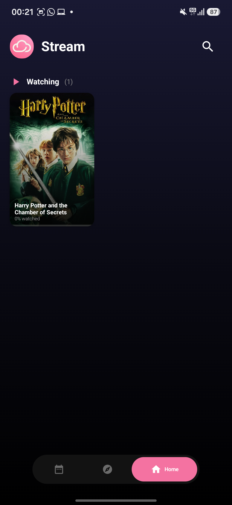
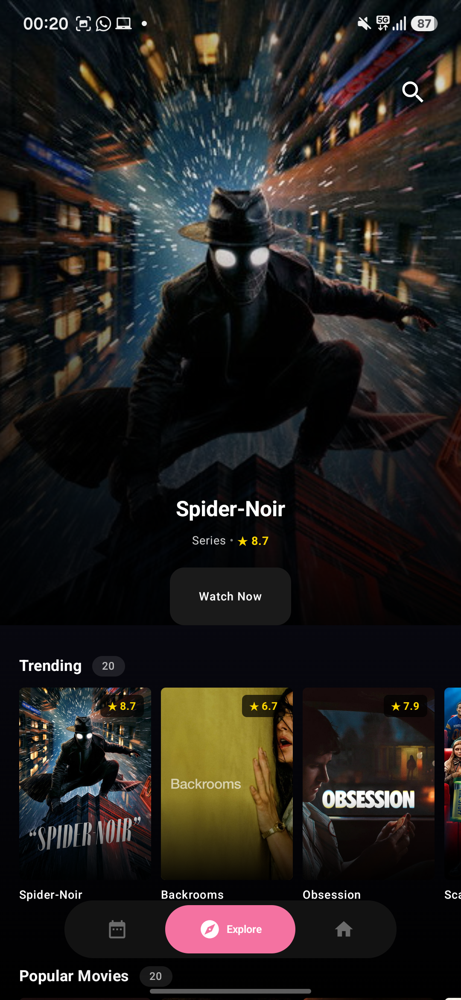
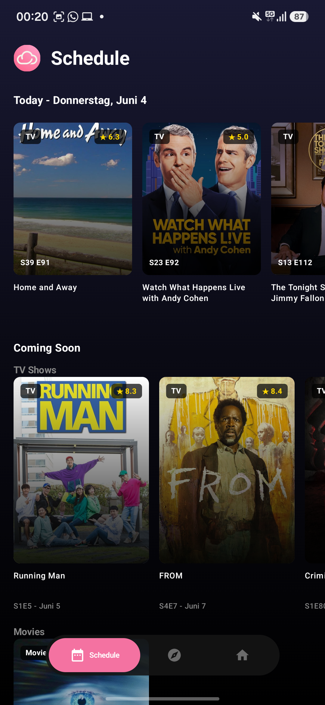
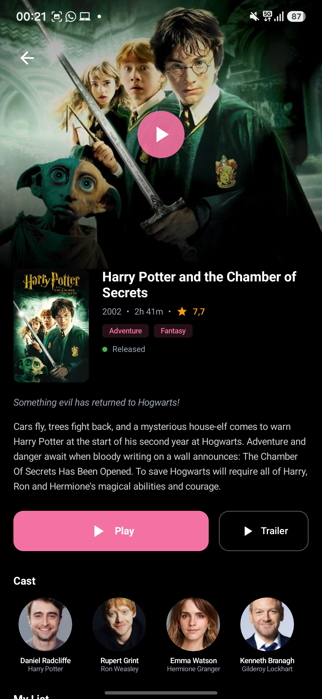
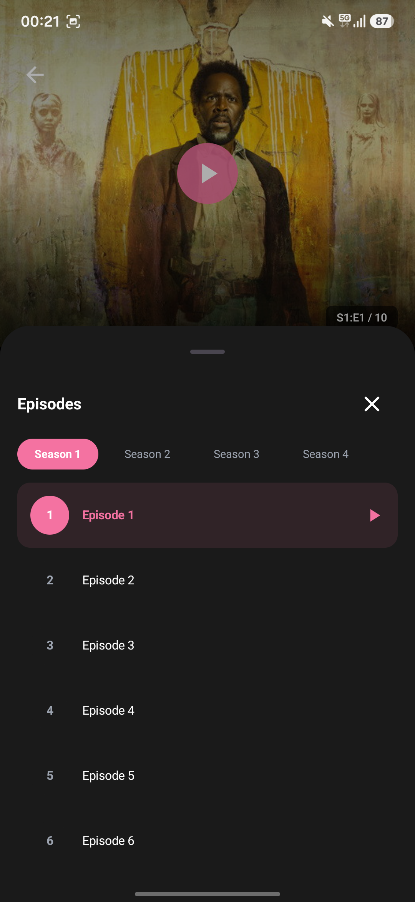
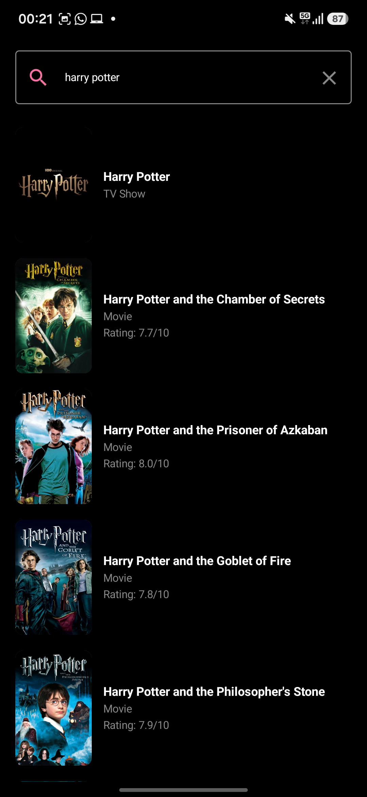

# Stream

A modern Android streaming app for discovering and watching movies and TV shows.

## Features

- **Explore** - Browse trending, popular, and top-rated movies and TV shows
- **Search** - Find content instantly with debounced search
- **Streaming** - Watch with built-in HLS player (ExoPlayer)
- **Episode Selection** - Season and episode picker for TV shows
- **Auto-next Episode** - Seamless playback continuation

## Screenshots

  
  
  

  
  
  

  

## Requirements

- Android 8.0+ (API 28+)

## Installation

Download the APK from [Releases](https://github.com/blissless/stream/releases) and install.

## Tech Stack

- Kotlin
- Media3 ExoPlayer
- TMDB API
- Glide
- MVVM Architecture

## Disclaimer

This app is for educational purposes only. I do not host, upload, or distribute any content. All streaming links are provided by third-party sources.
